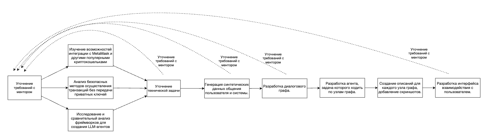
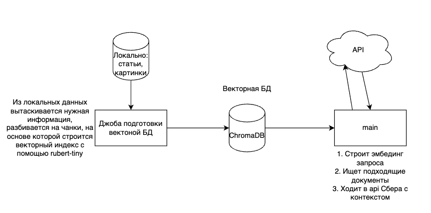
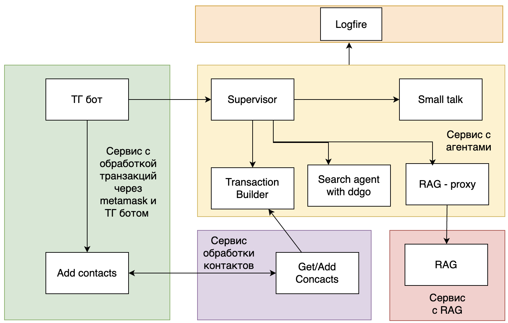

# ML System Design Doc
## Дизайн ML системы - AI агент для выполнение транзакций через NLP интерфейс

### **1. Цели и предпосылки**
### **1.1. Обоснованность разработки продукта**

### **Бизнес цель**
Создать помощника для выполнения транзакций через NLP интерфейс.
Сейчас, чтобы вложить актив в криптовалюту требуется глубокое погружение в область. Хочется упростить это процесс, как когда-то сделали Тинькофф инвестиции.
Требуется сделать помощника, который проведет по этапам до достижения результата (выполнения транзакции), на каждом из которых объяснит что происходит и сможет ответить на вопросы. При этом общее время должно быть снижено, по сравнению с временем, затраченным на ту же цель без использования бота.


### **Описание текущего бизнес-процесса**
<span style="color:red">На самом деле пока точно не углублялись в то, как это происходит в среднем. Тут скорее гипотеза.</span>

Текущий пользовательский путь:
- Пользователь изучает обзоры на YouTube, пытаясь повторить показанные действия;
- Сталкивается с общими объяснениями без конкретных деталей для его случая;
- Не имея возможности задать уточняющие вопросы обращается к поисковым системам, тратя значительное время на поиск релевантной информации;
- Сталкивается с техническими трудностями и непонятной терминологией;
- Вынужден самостоятельно интегрировать разрозненную информацию;
- Часто совершает ошибки из-за недостатка опыта и понимания процесса.


### **Целевая аудитория**

- Люди, желающие вложить средства в криптовалюту, без желания глубоко углубляться в технический процесс
- Люди, желающие ускорить процесс подготовки транзакций


### **Критерий успеха**
На 30% сокращено время пользователя от момента, когда он захотел вложить деньги до покупки, в сравнении с тем, чтобы человек сам разбирался с тем, как решить его задачу.


### **1.2. Бизнес-требования и ограничения**

**Целевое видение:**

- Работа в формате телеграм бота с мини апой, с подтверждением транзакции в приложении метамаска. [Видео](https://drive.google.com/file/d/13oFI2d_xw7LLEB71_ymbwK96m0Q3mtQL/view?usp=sharing)
- Пошаговые инструкции с визуальным сопровождением (скриншоты).
- Точные ответы на вопросы пользователя, в случае, если необходимо что либо объяснить.
- Пользователь успешно достигает целевого результата как минимум на 30% быстрее, чем используя другие инструменты.
- <span style="color:yellow">*Пользователь с помощью сообщений боту может осуществить транзакцию</span>
- Мультиплатформенность

**Целевое видение для MVP**
- Работа в формате телеграм бота аналогично целевому видению
- Возможность добавить контакта за одно сообщение (вся необходимая информация содержится в 1 сообщении)
- Возможность совершить транзакцию при достаточной информации в одном сообщении
- Ответы на часто задаваемые вопросы о криптовалютах и процессе покупки
- Достижение целевого результата без необходимости обращения к сторонним информационным ресурсам (поиска, LLM)

**Технические ограничения**
- Безопасность осуществления транзакций требует особого внимания - необходим механизм, не требующий передачи приватных ключей
- Требования к производительности и скорости ответа системы (не более 5 секунд задержки)


### **1.3. Что входит в скоуп проекта/итерации, что не входит**

Первая итерация - дедлайн 19 апреля 2025

- Изучение возможностей безопасной интеграции с криптокошельками
- Прототип интерфейса взаимодействия с пользователем
- Выбор и настройка фреймворка для создания LLM-агента
- Разработка базового диалогового графа для основных сценариев
- Разработка сервиса с RAG
- Разработка сервиса для добавления контактов
- Допускается отсутствие интеграции между компонентами

Вторая итерация - дедлайн 26 апреля 2025
- Интеграция с metamask
- Создание микросервиса для каждой из компонент
- Интеграция всех микросервисов между собой
- Деплой на сервере


Домены на которых будет работать RAG:
- ✅ Документация metamask (MVP)
- ❌ Общие вопросы по криптовалюте (Только в рамках дальнейшего развития)
- ❌ <span style="color:yellow"> Предоставление контекстуальной информации о текущем состоянии рынка </span> -- необходимость требует обсуждения. upd: попросили сделать возможность по находить адреса определенных протоколов и уметь на них переводить. Например: положи 10 ETH в aave. (Только в рамках дальнейшего развития)

Данные для RAG:
- ✅ На первом этапе предполагается использовать синтетические вопросы, сгенерированные llm, которые потенциально может задать пользователь (MVP)
- ✅ На первом этапе для общих вопросов тоже можно спарсить какой-то сайт с русской/английской документацией (MVP)
- ✅ Для домена metamask спарсить документацию (вместе с картинками) (MVP)


### **1.4. Предпосылки решения**

Для MVP:
Использование готового фреймворка для создания Агентов с помощью LLM (как вариант LangChain). Возможность готовить транзакцию, если вся необходимая информация есть в одном сообщении. Возможность отвечать на вопросы с помощью RAG по документации metamask.

На будущее:
Проектируется граф диалога, по которому будет ходить агент. Граф состоит из узлов, которые должны проводить пользователя поэтапно до осуществления транзакции. Для каждого узла пишется подробное сообщение со скриншотом для очередного действия пользователя. При этом поддерживается возможность на каждом шаге задать вопрос как по процессу осуществления транзакции, так и по стороннему вопросу. Для первой стадии все работает через api LLM.

Технические детали: <span style="color:red">Это сюда? Или куда?</span>
- В качестве векторной БД предлагается использовать Chroma
- Исходные файлы документации в первое время предлагается хранить просто в виде файлов (картинки + json с текстом и html), подготовленные файлы для Chroma хранить в обычном json
- В качестве retrieval модели предлагается на первой стадии использовать rubert-tiny2 из-за ограничения в вычислительных ресурсах. Можно также рассмотреть использование bm25, но для этого нужно иметь документацию на том же языке, что будут запросы, на текущий момент документация на английском (на русском она есть, но не получилось ее нормально спарсить).
- В качесте generation модели предлагается использовать gigachat-api/mistral, т.к. там есть бесплатные токены
- Предлагается из langchain использовать сплиттер и модель gigachat
- Для реализации api предлагается использовать fastapi

Все метрики предлагается считать на корзинках запросов


### **2. Методология `Разработчик`**

### **2.1. Постановка задачи**

**Исследовательская фаза:**

- Изучение возможностей интеграции с MetaMask и другими популярными криптокошельками
- Анализ безопасных методов осуществления транзакций без передачи приватных ключей
- Исследование и сравнительный анализ фреймворков для создания LLM-агентов

**Разработка**
- Генерация синтетических данных общения пользователя и системы;
- Разработка компоненты построения транзакций;
- Разработка агента супервизора (определяет интент пользователя и отправляет в соответствующий сервис/компоненты);
- Разработка компоненты RAG;
- Разработка компоненты добавления контактов;
- Разработка компоненты распознавания контактов;
- Разработка интерфейса взаимодействия с пользователем (Бот в Телеграм)<span style="color:red">По этой причине поставил методологию Разработчик, а не DS</span>;
- Разработка агента с минимально необходимым набором функций;
- Разработка диалогового графа;
- Создание описаний для каждого узла графа, добавление скриншотов;
- Разработка агента, задача которого ходить по узлам графа;
- Разработка компоненты переключения на оператора;
- На будущее: разработка компоненты отслеживания диалога: компонента которая будет отслеживать какие еще необходимы данные для определенного интента (например в ситуации когда пользователь хочет добавить контакт и указал имя, но не указал адрес кошелька - нужно уметь задавать уточняющий вопрос именно про кошелек);


### **2.2. Блок-схема решения**




### **2.3. Этапы решения задачи Data Scientist**

**Этап 1: подготовка бейзлайна.**

Выделено несколько компонент с моделями:
- Компонента построения транзакций
- Компонента определения интента
- Компонента RAG
- Компонента распознавания контактов
- Компонента распознавания запроса оператора (для поздних стадий развития)
- Компонента отслежвания статуса диалога (для поздних стадий развития, описане есть в разделе "Разработка")

| Название данных  | Описание данных | Есть ли данные | Требуемый ресурс для получения данных (какие роли нужны) | Проверено ли качество данных (да, нет) | Для какой компоненты необходимы данные |
| ------------- | ------------- | ------------- | ------------- | ------------- | ------------- |
| Транзакции | Сообщения, в которых пользователь просит перевести своему контакту определенное кол-во валюты (возможно в определенной сети). Для MVP - все необходимые данные должны быть в одном сообщение. | Данных нет, предлагается сгенерировать корзинку с помощью gpt модели | DE/DS | - | Построение транзакций |
| Контакты | Для каждого сообщения пользователя информация о его контактах на момент сообщения | Данных нет, предлагается сгенерировать корзинку с помощью gpt модели | DE/DS | - | Построение транзакций |
| Интенты | Сообщения с размеченным интентом пользователя (для MVP нужно 3 класса: транзакция, вопрос, добавление контактов) | Данных нет, предлагается сгенерировать корзинку с помощью gpt модели | DE/DS | - | Определение интента |
| Вопросы | Вопросы пользователей | Данных нет, предлагается сгенерировать корзинку с помощью gpt модели | DE/DS | - | RAG |
| Документация Metamask | Документация по Metamask по которой будет осуществляться поиск | + | DE/DS | да | RAG |
| Добавление контактов | Сообщение в которых пользователь хочет добавить контакт | Данных нет, предлагается сгенерировать корзинку с помощью gpt модели | DE/DS | - | Распознавание контактов |
| Переключение на оператора | Сообщение в которых пользователь просит переключить на оператора | Данных нет, предлагается сгенерировать корзинку с помощью gpt модели (на поздних стадиях развития) | DE/DS | - | Распознавание запроса оператора |
| История диалогов | Набор сообщений, где пользователь мог не указать достаточное количество данных для определенного интента. Например указал имя контакта, но не указал кошелек | Данных нет, на будущее предлагается сгенерировать корзинку с помощью gpt модели (на поздних стадиях развития) | DE/DS | - | Отслеживание статуса диалога |

Из основных очевидных проблем - полное отсутсвие данных от пользователей, т.к. проект новый. Для базовой оценки сформируем корзинки запросов. Пока данных для обучения нет - будем использовать LLM по API. Постепенно заменять синтетику реальными данными. Также копить данные для обучения. 

Единственные данные для моделей которые есть - документация metamask.
<span style="color:red">Считается ли адрес кошелька конфиденциальной информацией? А имена контактов? -- надо обсудить</span>

**Этап 2. Подготовка прогнозных моделей**

Оценка качества RAG:

- Для начала важно оценить полноту базы знаний. Оценили следующим образом: собрали все вопросы и всю существующую документацию и попросили claude 4.0 ответить содержится ли информация, необходимая для ответа на каждый вопрос в документации или нет. Далее провели аггрегацию по категориям. Получили следующие значения:
    - Установка и начальная настройка: 12/20 (60%)
    - Базовое использование: 1/12 (8.3%)
    - Сети и подключение: 4/18 (22.2%)
    - Отправка и получение криптовалют: 6.5/20 (32.5%)
    - Безопасность и восстановление: 6/15 (40%)
    - Продвинутое использование: 2.5/15 (16.7%)
    - Проблемы с интерфейсом и решение ошибок: 0.5/10 (5%)
    - Мобильное приложение MetaMask: 2/10 (20%)
    Видно, что база знаний неполная.
- Качество поиска для RAG: метрика - recall@3. Исходную разметку получим с помощью Claude 4.0. Для оценки recall@3 будет использовать только те вопросы, на которые есть ответы. В случае обучения InfoNCE лосс. 
- Качество ответов: llm as a judge на релевантность. <span style="color:yellow">Тут сразу стоит определиться с тем, что должна отвечать модель, если релевантной информации от поиска не пришло. Скорее всего говорить "извините, я не могу ответить на этот вопрос"</span>.  В случае дообучения - кроссэнтропийный лосс. Тут стоит разработать инструкцию какой ответ мы считаем релевантным, а какой - нет.


(База знаний)[https://drive.google.com/file/d/1cpcp4WnIIqEUWHZhJNZmIt-_wrHCLfTw/view?usp=sharing]
(Вопросы)[https://drive.google.com/file/d/1IvsLWSHnc7NKw5o2uLwMwJulR2PVoHZ5/view?usp=sharing]

Оценка агента супервизора:

- Для начала в качестве метрики матчинга использовать accuracy. Если будет сильный дисбаланс классов - перейдем на другую. В случае дообучения на задачу классификации будем использовать cross-entropy лосс.

Оценка агента подготовки транзакций:

- Метрика f1. Дообучать в ближайшем времени не будем.

Каждый из модулей будем тестировать на своей корзинке запросов, сгенерированных llm.

*Бейзлайн:*

Для агента супервизора, агента подготовки транзакций используем gemini. Для RAG используем gigachat. Модели используем по API. Никаких переформулировок не используем и других предобработок запросов не используем.

*Риски:*

- Модели могут работать плохо. С этим можно бороться взяв более большие, дорогие модели.
- Проблемы с API. 
    - Слишком частые запросы. Такая ситуация уже возникала, решилась переходом на другую модель. Так можно попробовать сделать несколько ключей и брать тот, который дольше всего не использовался.
    - Большие задержки с работой по API. Все еще попробовать перейти на другую llm.
- Использовать модели по API может оказаться слишком дорого. Стоит попробовать техники:
    - Сжатия промтом.
    - Покупка видеокарты и запуск LLM локально.
    - Брать более маленькие, дешевые модели.


*Дальнейшее развитие:*

- Возможно потребуются дополнительные компоненты, например поиск в интернет. Для информации об актуальных курсах валют.
- Исследование возможности сокращения инструкций, для сокращения кол-ва потраченных токенов.
- Для RAG компоненты попробовать использовать mistral для улучшения качества.
- Для поиска попробовать использовать user-bge-m3.
- Если какая-то компонента, например, поиск будет работать плохо на определенных запросах - попробовать использовать переформулировки с помощью llm.
- В случае наличия собственной видео карты - рассмотреть возможность использовать локальные llm.


**Этап 3: Обучение бейзлайна и модели**

Предобработка в данном случае не требуется, только удаление специфичных символов, но пока нет реальных данных использовать такой подход не будем.
Поскольку реальных данных для обучения пока нет, обучать не будем, но оценим несколько разных моделей для сравнения качества. Оценивать будем модели ретривала.
Оценивать будем по 2ум критериям:
- recall@3
- время, требуемое для построения эмбединга запроса 
Временем требуемым для построения эмбедингов для документов пока пренебрежом, т.к. не предполагаем частого перестроения индекса.
Временем, требуемым для построения эмбединга запроса, возможно, тоже можно будет пренебречь, т.к. вероятно этап генерации ответов будет значительного дольше.

| Модель | Время инференса квери, с | Метрика | Результат |
| ------ | ------------------------ | ------- | --------- |
|cointegrated/rubert-tiny2 - без пропроцессинга|0.0056|recall@3|0.163|
|cointegrated/rubert-tiny2 - с .lower() для query|0.0056|recall@3|0.165|
|intfloat/multilingual-e5-base без препроцессинга|0.05|recall@3|0.021|
|deepvk/USER-bge-m3 без препроцессинга|0.146|recall@3|0.459|
|deepvk/USER-bge-m3 без препроцессинга|0.146|recall@5|0.606|
|deepvk/USER-bge-m3 с .lower()|0.146|recall@5|0.606|
|deepvk/USER-bge-m3 без препроцессинга|0.146|recall@10|0.790|

Метрика близости - косинусное расстояние.
Замеры проводились в одинаковом сетапе на cpu на macbook pro m3.
В качестве бейзлайна рассматривалась модель cointegrated/rubert-tiny2, в качестве основной будет использована deepvk/USER-bge-m3.

Выводы:
1. Более менее приличное качество дает только (из проверенных) bge-m3. 
2. Препроцессинг в виде .lower не дает улучшений
3. На время инференса модели на квере можно пренебречь, т.к. ответ llm занимает значительно больше времени
4. Из анализа данных: чанки разбиты неаккуратно, можно попробовать пограться с ними: улучшить разбиение, можно попробовать добавить заголовок статьи в начало или добавить суммаризацию всего чанка.
В целом домен довольно специчный, еще и на запрос и документ на разных языках, безусловно это негативно сказывается на качестве работы модели.

### **3. Подготовка пилота**

Поскольку сервис еще не существует в проде нужно оценить насколько наш сервис приносит пользу. 
Глобально у нас 2 основные цели:
1. Экономить время новичкам на освоение.
2. Экономить время за счет удобного интерфейса взаимодействия
Нужно сконцентрироваться на одной - на первой.
Для начала нужно выбрать группу пользователей и случайно разбить их на 2 подгруппы. В каждой группе по 25 человек.
Первую попросить выполнить транзакцию с определенными параметрами без использования нашего сервиса, вторую только с использованием нашего сервиса. При этом первая группа может пользоваться всем, чем захочет (будь то google, llm и др.). При этом важно, чтобы человек хотя бы примерно понимал что при каждом нажатии. Для этого можно попросить человека в общих чертах описывать что он сейчас делает.
Сравнив первую группу со второй мы получим ответ на вопрос ускоряет ли использование нашего сервиса время на освоение с достижением результата.

Важно отобрать именно начинающих, но заинтересованных людей. Можно отобрать в телеграмм каналах по опросу.

Далее проанализируем трудности с которыми сталкивались пользователи из второй группы. Исправим их и возмем еще одну группу на 25 человек и попросим ее выполнить ту же задачу, но мы только расскажем о наличии нашего сервиса без обязательства пользоваться им. Это нам покажет почему пользователь может бросить на "пол пути" использование нашего сервиса, а доведет свое действие до конца.

**Критерий успеха:** Успешным пилотом будем считать одновременное выполнение следующих условий:
1. Сокращение времени на выполнение задания у второй группы по сравнению с первой хотя бы на 30%. 
2. Из третьей группы хотя бы 30% совершают задание при помощи нашего бота, а не уходят использовать другие сервисы. (Пока ограничимся таким определением, но могут возникать ситуации когда пользователь через наш сервис решает только специфичную задачу, считать такие случаи подходящими или нет - определим по ситуации)
3. В первой подгруппе кол-во завершивших транзакцию больше, чем во второй.
4. Количество ошибок, совершенных пользователями в первой группе меньше, чем во второй.

**Задание:** Создайте MetaMask кошелек, передайте свои реквизиты и получите 5$. Оставить 70% ваших средств, а остальное положите в Uniswap V3 ETH/USDC с диапазоном ±10% от текущей цены..

**Появнение задания:** отя не менее важной задачей является задача положить средства на кошелек, 5$ будут переведены пользователю, для экономии его средств и времени. Задача оставить ровно 70% ставится из соображений, что нужно учитывать цену газа.


**Ограничения на сервис:**
1. Бюджет на api на одного пользователя: 2$
2. SLA: 80% ответов < 3 секунд , 100% ответов < 5 секунд (разные интенты могут работать с разной скоростью)

*Эксперименты будем проводить последовательно с каждым пользователем, в случае, если видим серьезную проблему - переносим тестирование на других пользователях, решаем проблему только затем продолжаем тестирование (не беря в статистику первых пользователей). Например, если задание окажется слишком сложным.*

**Методология измерений:**

1. Видеозапись экрана пользователей
2. Трекинг всех действий пользователей
3. Post интервью на 10-15 минут по трудности и недостатки сервиса


### **4. Внедрение**

**В настоящий момент сервис отдельно RAG доступен по ссылке http://45.81.35.238:8001/docs**

Пример запроса с помощью curl:
```
curl -X 'POST' \
  'http://45.81.35.238:8001/query' \
  -H 'accept: application/json' \
  -H 'Content-Type: application/json' \
  -d '{
  "query": "Как восстановить доступ к аккаунту metamask?",
  "max_results": 3,
  "temperature": 0.7
}'
```

**4.1. Архитектура решения**
  
**Архитектура сервиса RAG:**



**Микросервисная архитектура всего приложения**


  
**4.2. Описание инфраструктуры и масштабируемости**

Для пилота будет использоваться витруальная машина в сервисе https://vps.datacheap.ru/ со следующими ресурсами:
| Ресурс | Объем |
| ------ | ----- |
|cpu|4|
|RAM|8GB|
|Disk|50Gb|

Это оптимальное решение по цене 840 р/мес.
Сервис находится за границей, поэтому нет проблем с доступом к gemini (через Российских провайдеров есть проблемы с доступом).
  
**4.3. Требования к работе системы**
  
В первое время высокой нагрузки не ожидается. Однако стоит предусмотреть обработку запросов как минимум от 3 пользователей параллельно.
  
**4.4. Безопасность системы**
  
Могут возникнуть проблемы с обходом системного промта.
Доступа до контактов чужих пользователей быть не может, посколько контакты отбираются для каждого пользователя по его telegram id. Доступа до сервиса с контактами ни у кого нет.
  
**4.5. Безопасность данных**
  
На текущий момент из чувствительных данных только адреса кошельков и имена контактов. Приватные ключи не хранятся. Эти данные сейчас не удовлетворяют всем требованиям GDPR, в дальнейшем это будет исправлено.
  
**4.6. Издержки**
  
840р/мес аренда виртуальной машины.
Для агентов считать, что в среднем запрос занимает 1000 токенов. По цене 0.1$ за 1 000 000 токенов. Будем считать, что в месяц будем обрабатывать около 1000 пользователей, так что примерно 10р/мес.
Для RAG используется gigachat light, там есть большое кол-во бесплатных токенов, а цена после превышения лимитов пренебрежительно мала.
Итого: 850р/мес.
  
**4.7. Integration points**
  
Сервисы взаимодействуют между собой по API
  
**4.8. Риски** 
  
- Недоступность LLM моделей
- Отказ сервиса из-за высокой нагрузки
- ddos атаки

**4.9 Нагрузочное тестирование**

Нагрузка проводилась в двух конфигурациях:
1. Тестирование системы в нормальном режиме работы:
Запросы от одного пользователя каждые 2 - 5 секунд, 3 одновременных пользователя.
2. Стресс тестирование системы:
5 одновременных пользователей, запросы каждые 1-2 секунды.

**Результаты нагрузочного тестирования RAG системы**

## Тестирование в нормальном режиме

### Основные метрики времени отклика в нормальном режиме

| Эндпоинт | Запросов | Успешность | Среднее (с) | Минимум (с) | Максимум (с) | Медиана (с) | RPS |
|----------|----------|------------|--------------|--------------|---------------|--------------|-----|
| **POST /query** | 16 | 100% | 5.6 | 2.8 | 9.4 | 5.5 | 0.28 |
| **GET /health** | 4 | 100% | 3.6 | 1.9 | 5.3 | 2.9 | 0.07 |
| **Общие показатели** | **20** | **100%** | **5.2** | **1.9** | **9.4** | **5.3** | **0.35** |

### Перцентили времени отклика (с)

| Эндпоинт | 50% | 75% | 80% | 90% | 95% | 99% |
|----------|-----|-----|-----|-----|-----|-----|
| **POST /query** | 5.7 | 7.4 | 7.4 | 7.5 | 9.4 | 9.4 |
| **GET /health** | 4.3 | 5.3 | 5.3 | 5.3 | 5.3 | 5.3 |
| **Общие показатели** | **5.4** | **7.1** | **7.4** | **7.5** | **9.4** | **9.4** |

---

## Стресс-тестирование

### Основные метрики времени отклика

| Эндпоинт | Запросов | Успешность | Среднее (с) | Минимум (с) | Максимум (с) | Медиана (с) | RPS |
|----------|----------|------------|--------------|--------------|---------------|--------------|-----|
| **POST /query** | 17 | 94.12% | 13.3 | 1.9 | 23.8 | 14 | 0.29 |
| **Общие показатели** | **17** | **94.12%** | **13.3** | **1.9** | **23.8** | **14** | **0.29** |

### Перцентили времени отклика (с)

| Эндпоинт | 50% | 75% | 80% | 90% | 95% | 99% |
|----------|-----|-----|-----|-----|-----|-----|-----|
| **POST /query** | 14 | 16 | 16 | 17 | 24 | 24 |
| **Общие показатели** | **14** | **16** | **16** | **17** | **24** | **24** |

---

## Сравнение результатов

| Метрика | RAGSystemUser | RAGStressUser | Деградация |
|---------|---------------|---------------|-------------|
| **Среднее время отклика** | 5.2 с | 13.3 с | +157% |
| **Медиана** | 5.3 с | 14 с | +164% |
| **95-й перцентиль** | 9.4 с | 24 с | +155% |
| **Максимальное время** | 9.4 с | 23.8 с | +154% |
| **Успешность запросов** | 100% | 94.12% | -5.88% |
| **Requests per second** | 0.35 | 0.29 | -17% |

---

**Выводы:**

Нормальная нагрузка:
- Стабильная работа: 100% успешных запросов
- Медленные ответы: Среднее время 5.6 секунды
- Предсказуемость: 90% запросов выполняются за 7.5 секунды

Стресс-тестирование:
- Появление ошибок
- Сильная деградация: Время отклика увеличилось в 2.5 раза
- Непредсказуемость: Разброс от 1.9 до 23.8 секунды

Вывод: При нормальной нагрузке система работает стабильно, но для продакшена не готова. Нужна оптимизация для обработки больше 2-3 пользователей одновременно. На текущий момент при высокой нагрузке 5% запросов выполняются более 24 секунд - это критично для пользовательского опыта.
